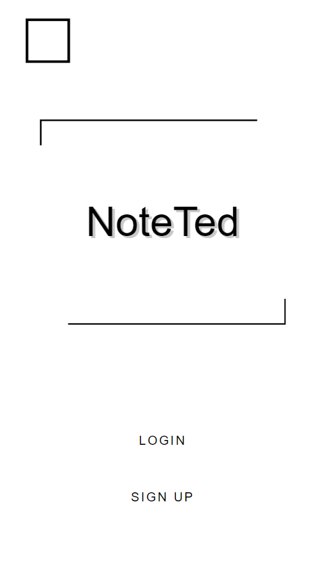
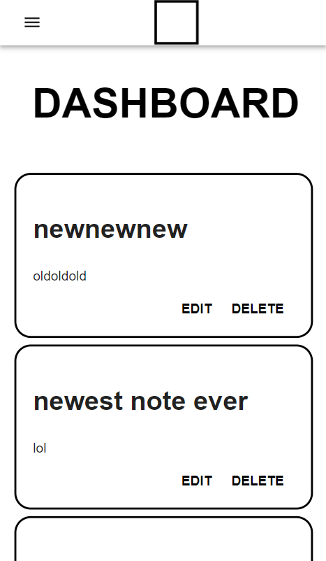
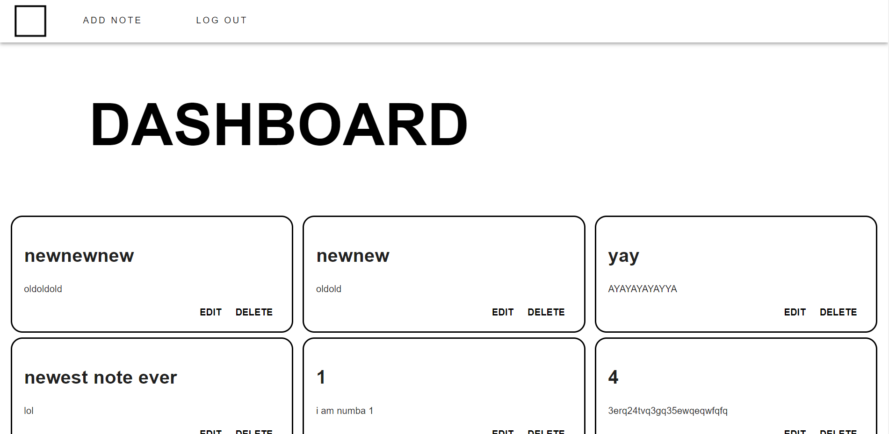

# NOTETED

This is a note taking application that users can save and access on the go. Users can add, edit and delete notes anywhere at anytime. Featuring a Mobile-first design, Users won't have to worry about not having access on their mobile device.

## How to run
First configure Firebase API key in a .env.local file

Then install node packages using 
```bash 
npm i
```
Then run the app using
```bash 
npm run dev
```

## Screenshots

### Home Page Mobile


### Home Page PC


### Dashboard Page Mobile


### Dashboard Page PC


## Technologies Used

```bash
Languages: HTML | CSS | JS
```

```bash
JS libraries: Next.js | ReactJs | MaterialUI
```

```bash
Backend: Firebase Auth | Firebase Firestore
```